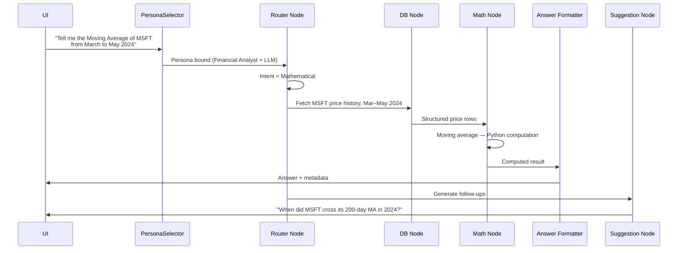
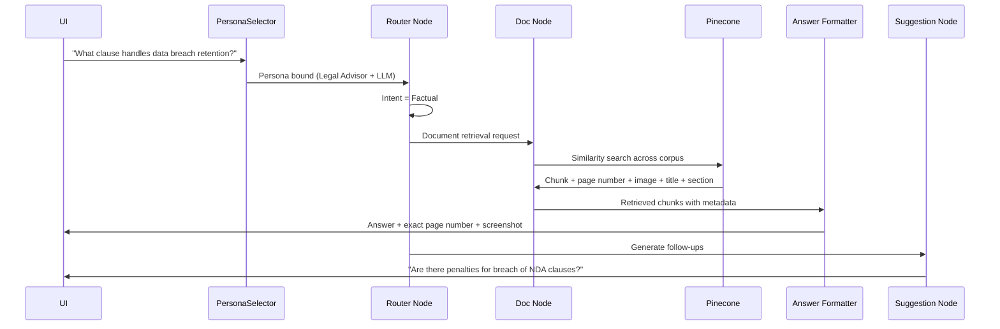

# Dynamic Agentic Systems — Architecture Plan

**Document type:** System architecture specification
**Source of truth:** `Dynamic_Agentic_Systems.pdf` (product specification)
**Scope note:** Every component, node, stack choice, and behaviour described below is derived directly from the attached specification. No features have been added beyond what the document defines.

---

## 1. High-Level System Overview

Dynamic Agentic Systems is an agentic query platform that sits over **two fundamentally different classes of knowledge base** — unstructured documents and structured tabular data — and routes each incoming user query to the correct execution pipeline based on intent.

The system is built around four architectural pillars:

**1. Multi-Knowledge-Base Integration.** A Document Knowledge Base holds legal and financial PDFs, indexed into a vector store. A Database Knowledge Base holds year-long stock market data, provided either as CSV or as a live SQL/NoSQL database connection. The two are queried through entirely separate node paths, because the retrieval semantics are different: similarity search for documents, deterministic queries for structured data.

**2. Persona-Driven LLM Selection.** Rather than a single monolithic assistant, the system exposes three domain-specific personas — **Financial Analyst** (math and stocks), **Legal Advisor** (compliance and contracts), and **General Assistant** (mixed queries). Each persona is backed by an LLM provider selected at the frontend (OpenAI, Claude, DeepSeek). The persona is resolved *before* routing, so persona context is available to every node downstream.

**3. Accuracy-Driven RAG with Verifiable Citations.** The vector store persists not just chunk content but structural metadata — page number, an image of the chunk, document title, and section. Every document-derived answer is returned with the exact page number and a rendered screenshot from the PDF, so the user can visually verify the source rather than trusting the model's assertion.

**4. Speed and Precision Through Computation Offload.** Mathematical work — moving averages, trends, threshold checks — is executed by dedicated Python nodes, **not** by an LLM. The LLM's role is intent classification, persona-voiced narration, and suggestion generation. Numerical correctness is a deterministic property of the system, not a probabilistic one.

Orchestration across all of this is handled by **LangGraph**, which routes each query through the appropriate node sequence. The frontend is a three-panel Next.js interface that additionally exposes the pipeline itself — a live trace and visual flow of query processing — so the system's routing decisions are observable and debuggable rather than opaque.

### System-Level Data Flow (narrative)

1. User submits a query through the center chat panel, having selected a persona in the left panel.
2. **PersonaSelector** resolves the persona and binds the corresponding LLM backend.
3. **RouterNode** classifies intent and dispatches to one or more of DocNode, DBNode, MathNode, and SuggestionNode.
4. Document queries resolve through Pinecone retrieval; database queries resolve through SQL and, where computation is required, chain into the MathNode.
5. **AnswerFormatter** attaches source metadata and the page screenshot to the final answer.
6. **SuggestionNode** returns recommended follow-up queries directly to the UI, sustaining conversational flow.
7. Throughout, node lifecycle events stream to the frontend over WebSocket to drive the live trace view.

---

## 2. Phased Architecture Plan

The build is sequenced so that each phase produces something independently verifiable, and no phase depends on a later one. Data infrastructure comes first because every intelligent behaviour in the system is a function of whether the retrieved data is correct.

---

### Phase 1 — Foundation, Ingestion & Storage Layer

**Goal:** Both knowledge bases exist, are populated with real data, and are directly queryable outside of any agent logic.

**Components to build**

| Component | Responsibility |
|---|---|
| Project scaffold | Backend and frontend repos, environment/config management, API key handling for LLM providers and Pinecone |
| PDF ingestion pipeline | Chunk document content; extract per-chunk metadata — page number, chunk image, title, section; render page screenshots for citation |
| OCR / screenshot extraction | Produce the page-image artefacts the DocNode returns alongside answers |
| Embedding + Pinecone upsert | Write chunk content and full metadata payload into the vector store |
| Database ingestion | Load year-long stock market data from CSV, or connect to an existing SQL/NoSQL source |
| Storage access layer | Thin wrappers over Pinecone and the relational/document database |

**Dependencies:** None. This is the root of the dependency graph.

**Exit criteria:** A direct vector query returns the correct chunk *with* an accurate page number and a valid image reference. A direct SQL query returns correct price rows for a given ticker and date range.

---

### Phase 2 — Retrieval & Computation Nodes

**Goal:** The three data-facing nodes work correctly as standalone, independently testable units.

**Components to build**

| Component | Responsibility |
|---|---|
| **DocNode** | Vector search across the Pinecone corpus; returns chunks with page number, image, title, section |
| **DBNode** | Executes SQL queries for historical stock data |
| **MathNode** | Moving averages, trend detection, threshold checks — pure Python, no LLM involvement |

**Dependencies:** Phase 1 (both knowledge bases populated).

**Exit criteria:** Each node can be invoked in isolation with a fixed input and produces correct output. MathNode results are verifiable against manual computation — this is the phase where numerical accuracy is proven, before orchestration can obscure where an error originated.

---

### Phase 3 — Persona Layer & LLM Provider Abstraction

**Goal:** Persona selection resolves to a concrete LLM backend, and personas are configuration rather than branching code.

**Components to build**

| Component | Responsibility |
|---|---|
| LLM provider abstraction | A uniform interface across OpenAI, Claude, and DeepSeek so nodes are provider-agnostic |
| Provider registry | Registration and API-key management per provider |
| Persona definitions | Financial Analyst, Legal Advisor, General Assistant — each with domain framing and an assigned LLM backend |
| **PersonaSelector node** | Routes the request to the selected LLM/persona backend |

**Dependencies:** Phase 1 (config and key management).

**Exit criteria:** The same query, run under two different personas, produces domain-appropriate framing. Switching a persona's provider changes which backend serves the call, with no change to node code.

---

### Phase 4 — LangGraph Orchestration & Routing

**Goal:** The full graph is assembled and every edge defined in the specification is exercised.

**Components to build**

| Component | Responsibility |
|---|---|
| Shared graph state schema | The typed object passed between nodes: query, persona, intent, retrieved chunks, DB results, math results, answer, citations, suggestions |
| **RouterNode** | Intent classification across the three query types — Mathematical, Factual, Conversational — and dispatch to the correct node(s) |
| Intent-to-node mapping | The registry that makes routing extensible rather than hardcoded |
| Graph assembly | Wiring per the specified topology: `PersonaSelector → RouterNode`; `RouterNode → DocNode / DBNode / MathNode / SuggestionNode`; `DBNode → MathNode`; `DocNode → AnswerFormatter`; `MathNode → AnswerFormatter` |

**Dependencies:** Phases 2 and 3 — the router has nothing to route to without working nodes and a resolved persona.

**Exit criteria:** Both sample query flows from the specification traverse their correct paths end to end:
- *"Tell me the Moving Average of MSFT from March to May 2024"* → Router → DBNode → MathNode → Formatter → UI
- *"What clause handles data breach retention?"* → Router → DocNode → Formatter → UI

---

### Phase 5 — Answer Formatting, Suggestions & API Surface

**Goal:** A complete, citation-bearing response is available over the API, including follow-up suggestions.

**Components to build**

| Component | Responsibility |
|---|---|
| **AnswerFormatter node** | Merges answer text with source metadata and the page screenshot into the final response payload |
| **SuggestionNode** | Generates recommended follow-up queries to sustain conversational flow |
| REST API layer | Query submission, PDF/CSV upload, database connection registration, persona and provider configuration |
| WebSocket trace channel | Emits node lifecycle events for the frontend's live pipeline trace |

**Dependencies:** Phase 4.

**Exit criteria:** A single API call returns answer text, exact page number, screenshot reference, and suggested follow-up queries. Node events arrive over WebSocket in the order the graph executed them.

---

### Phase 6 — Frontend Interface

**Goal:** The full three-panel interface described in the specification, operating against the live backend.

**Components to build**

| Panel | Contents |
|---|---|
| **Left** | KB source management — upload/attach PDFs, CSVs, SQL/NoSQL DB connections; persona management; per-persona LLM provider selection; add new LLMs via API key |
| **Center** | Chat interface, answers, suggested query chips |
| **Right** | Metadata and source display — PDF page preview, page number, title, section |
| **Cross-cutting** | Live test query execution, answer pipeline trace, visual flow of query processing for debugging |

**Dependencies:** Phase 5.

**Exit criteria:** Both sample queries are executed through the UI. Clicking a citation renders the correct PDF page preview in the right panel. The visual flow highlights the nodes that actually fired.

---

### Phase 7 — Dynamic Expansion & Scalability Hardening

**Goal:** Adding knowledge bases, documents, and LLMs is a configuration action, not a code change.

**Components to build**

| Component | Responsibility |
|---|---|
| DBNode instancing | Registering a new database provisions a new DBNode instance that auto-attaches to the RouterNode via intent mapping |
| Corpus-wide re-indexing | A newly added document is chunked and indexed into Pinecone; DocNode reruns vector search across the entire corpus without reconfiguration |
| Persona/LLM registration flow | Adding an LLM updates the PersonaSelector and surfaces a new persona toggle in the UI |

**Dependencies:** Phases 1–6.

**Exit criteria:** Each of the three expansion paths described in the specification is demonstrated live, with no redeploy of node logic.

---

## 3. Recommended Project File Structure

```
dynamic-agentic-systems/
├── README.md
├── docker-compose.yml
│
├── backend/
│   ├── requirements.txt
│   ├── Dockerfile
│   ├── .env.example
│   │
│   ├── app/
│   │   ├── main.py                          # FastAPI application entrypoint
│   │   │
│   │   ├── api/
│   │   │   ├── routes_query.py              # Query submission endpoint
│   │   │   ├── routes_knowledge_base.py     # PDF / CSV upload, DB connections
│   │   │   ├── routes_personas.py           # Persona CRUD + LLM assignment
│   │   │   ├── routes_providers.py          # Add new LLM via API key
│   │   │   └── routes_trace.py              # WebSocket pipeline trace channel
│   │   │
│   │   ├── core/
│   │   │   ├── config.py                    # Settings, API keys, provider config
│   │   │   ├── graph_builder.py             # LangGraph StateGraph assembly
│   │   │   ├── graph_state.py               # Shared typed state schema
│   │   │   └── intent_registry.py           # Intent → node mapping
│   │   │
│   │   ├── nodes/
│   │   │   ├── persona_selector.py          # Persona Selector Node
│   │   │   ├── router_node.py               # Router Node
│   │   │   ├── doc_node.py                  # Document RAG Node
│   │   │   ├── db_node.py                   # Database Node
│   │   │   ├── math_node.py                 # Math Execution Node
│   │   │   ├── suggestion_node.py           # Suggested Queries Generator
│   │   │   └── answer_formatter.py          # Answer + Metadata Formatter
│   │   │
│   │   ├── llm/
│   │   │   ├── base_provider.py             # Common LLM interface
│   │   │   ├── openai_provider.py
│   │   │   ├── claude_provider.py
│   │   │   ├── deepseek_provider.py
│   │   │   ├── provider_registry.py         # Dynamic provider registration
│   │   │   └── personas.py                  # Financial / Legal / General configs
│   │   │
│   │   ├── ingestion/
│   │   │   ├── pdf_processor.py             # Page extraction + chunking
│   │   │   ├── ocr_engine.py                # OCR + page screenshot rendering
│   │   │   ├── chunk_metadata.py            # page number, image, title, section
│   │   │   ├── embedder.py                  # Chunk embedding
│   │   │   ├── vector_indexer.py            # Pinecone upsert
│   │   │   └── db_loader.py                 # CSV / SQL / NoSQL ingestion
│   │   │
│   │   ├── retrieval/
│   │   │   ├── vector_store.py              # Pinecone client wrapper
│   │   │   ├── sql_store.py                 # PostgreSQL access layer
│   │   │   └── nosql_store.py               # MongoDB access layer
│   │   │
│   │   ├── compute/
│   │   │   ├── moving_average.py
│   │   │   ├── trend_analysis.py
│   │   │   └── threshold_checks.py
│   │   │
│   │   ├── tracing/
│   │   │   ├── trace_emitter.py             # Node lifecycle event emission
│   │   │   └── connection_manager.py        # WebSocket client management
│   │   │
│   │   └── schemas/
│   │       ├── query_schemas.py
│   │       ├── citation_schemas.py          # page number, screenshot, title, section
│   │       ├── persona_schemas.py
│   │       └── trace_schemas.py
│   │
│   ├── storage/
│   │   ├── documents/                       # Uploaded PDFs
│   │   ├── page_images/                     # Rendered page screenshots
│   │   └── datasets/                        # Uploaded CSVs
│   │
│   └── tests/
│       ├── test_nodes/
│       ├── test_ingestion/
│       ├── test_compute/
│       └── test_routing/
│
└── frontend/
    ├── package.json
    ├── Dockerfile
    ├── tailwind.config.ts
    │
    ├── app/
    │   ├── layout.tsx
    │   └── page.tsx                         # Three-panel workspace
    │
    ├── components/
    │   ├── layout/
    │   │   └── ThreePanelLayout.tsx
    │   │
    │   ├── knowledge-base/                  # LEFT PANEL
    │   │   ├── KBSourceList.tsx
    │   │   ├── PDFUploader.tsx
    │   │   ├── CSVUploader.tsx
    │   │   └── DatabaseConnectionForm.tsx   # SQL / NoSQL connections
    │   │
    │   ├── personas/                        # LEFT PANEL
    │   │   ├── PersonaSelector.tsx          # Financial / Legal / General
    │   │   ├── PersonaLLMAssignment.tsx     # Provider per persona
    │   │   └── AddLLMProviderForm.tsx       # Add new LLM via API key
    │   │
    │   ├── chat/                            # CENTER PANEL
    │   │   ├── ChatWindow.tsx
    │   │   ├── MessageBubble.tsx
    │   │   ├── CitationBadge.tsx
    │   │   └── SuggestedQueries.tsx
    │   │
    │   ├── trace/                           # PIPELINE OBSERVABILITY
    │   │   ├── PipelineTrace.tsx            # Answer pipeline trace
    │   │   └── QueryFlowGraph.tsx           # Visual flow for debugging
    │   │
    │   └── source-preview/                  # RIGHT PANEL
    │       ├── MetadataPanel.tsx            # Page number, title, section
    │       └── PDFPagePreview.tsx           # Rendered screenshot
    │
    ├── hooks/
    │   ├── useQuery.ts
    │   ├── useTraceSocket.ts                # WebSocket live tracing
    │   ├── usePersonas.ts
    │   └── useKnowledgeBases.ts
    │
    ├── lib/
    │   ├── api-client.ts
    │   └── socket-client.ts
    │
    └── types/
        ├── query.ts
        ├── citation.ts
        ├── persona.ts
        └── trace.ts
```

The backend folder boundaries deliberately mirror the LangGraph node boundaries, and the frontend component domains mirror the three-panel layout. The seams line up across the stack, which keeps ownership clear as the system grows.

---

## 4. Detailed Component Responsibilities

### 4.1 Orchestration Nodes

**Router Node**
Routes queries to the right node or nodes based on intent classification. It discriminates across the three query types the system supports — Mathematical (stock trends, moving averages, thresholds), Factual (specific document-based questions), and Conversational (multi-step, suggestion-driven dialogs). It is the single dispatch point in the graph; every downstream node depends on its classification being correct. It also reads the intent mapping registry, which is what allows newly added database nodes to attach themselves automatically.

**Document RAG Node**
Uses Pinecone plus OCR to retrieve documents with page number and image. It performs similarity search across the entire indexed corpus and returns matched chunks together with their full metadata payload. Because it always searches the whole corpus, newly indexed documents become searchable without any node-level reconfiguration.

**Database Node**
Runs SQL queries for historical data such as prices. It serves the Database Knowledge Base — year-long stock market data — and returns structured result sets. It either terminates at the formatter or feeds the MathNode when the query requires computation.

**Math Execution Node**
Handles computation-heavy queries such as moving average calculations, trend analysis, and threshold checks. This is a dedicated Python execution node: mathematical operations are offloaded here specifically so they are *not* performed by an LLM. It consumes structured rows from the DBNode and emits computed results.

**Persona Selector Node**
Routes the request to the selected LLM/persona backend. It resolves which of the three personas is active — Financial Analyst, Legal Advisor, or General Assistant — and binds the LLM provider assigned to that persona. It executes at the head of the graph, ahead of the router, so persona context is available to every subsequent node. When a new LLM or persona is added, this node is the update point.

**Suggestion Node**
Generates recommended queries to keep the conversational flow going. It is dispatched from the RouterNode and returns directly to the UI rather than through the formatter, so suggestions can surface independently of the main answer path.

**Answer Formatter Node**
Adds source metadata and screenshot into the final answer. It is the convergence point for both the document path and the database/math path, and is responsible for ensuring every document-derived answer carries its exact page number and rendered page screenshot.

### 4.2 Data & Storage Components

**Vector Store (Pinecone).** Stores chunk content alongside metadata: page number, image of chunk, title, and section. This metadata schema is what makes verifiable citation possible — the citation contract is established at ingestion time, not reconstructed at answer time.

**Document Ingestion Pipeline.** Chunks incoming PDFs, extracts metadata per chunk, renders page screenshots via OCR, embeds chunk content, and indexes into Pinecone.

**Structured Database (PostgreSQL / MongoDB).** Holds the year-long stock market dataset, populated from uploaded CSVs or connected directly as an existing SQL/NoSQL source.

### 4.3 LLM Provider Layer

A uniform provider interface backs OpenAI, Claude, and DeepSeek. Each persona is bound to one provider. New providers are registered by supplying an API key through the frontend, which is why the interface must be uniform — node code cannot contain provider-specific branches if providers are addable at runtime.

### 4.4 Frontend Components

**Left Panel — KB Sources and Persona Management.** Upload or attach PDFs, CSVs, and SQL/NoSQL DB connections. Select the LLM provider per persona. Add new LLMs via API keys.

**Center Panel — Chat, Answer, Suggested Queries.** Query submission, answer rendering with citation affordances, and clickable suggested follow-ups.

**Right Panel — Metadata and Source.** PDF page preview showing the rendered screenshot, page number, title, and section for the cited chunk.

**Tracing Layer.** Live test queries with answer pipeline tracing, and a visual flow of query processing for debugging — driven by node lifecycle events delivered over WebSocket.

---

## 5. Full Architectural Diagram

```mermaid
flowchart TD

    %% ============ FRONTEND ============
    subgraph FE["FRONTEND — Next.js / Tailwind / ShadCN"]
        direction TB
        LEFT["LEFT PANEL<br/>KB Sources + Persona Management"]
        CENTER["CENTER PANEL<br/>Chat + Answer + Suggested Queries"]
        RIGHT["RIGHT PANEL<br/>Metadata + PDF Page Preview"]
        FLOW["Visual Query Flow<br/>Pipeline Trace / Debugging"]
    end

    %% ============ UPLOAD / CONFIG ============
    subgraph UP["KB SOURCE ATTACHMENT"]
        direction TB
        UPDF["Upload PDFs"]
        UCSV["Upload CSVs"]
        UDB["Attach SQL / NoSQL<br/>DB Connection"]
        UKEY["Add New LLM<br/>via API Key"]
    end

    %% ============ API ============
    subgraph API["API BACKEND — FastAPI / Node.js"]
        direction TB
        QEP["Query Endpoint"]
        IEP["Ingestion Endpoints"]
        CEP["Persona + Provider Config"]
        WSC["WebSocket Trace Channel"]
    end

    %% ============ INGESTION ============
    subgraph ING["INGESTION PIPELINE"]
        direction TB
        CHUNK["Chunking"]
        OCR["OCR / PDF Render<br/>Screenshot Extraction"]
        META["Metadata Builder<br/>page number, image,<br/>title, section"]
        EMB["Embedding"]
        LOAD["Structured Data Loader"]
    end

    %% ============ ORCHESTRATION ============
    subgraph LG["LANGGRAPH ORCHESTRATION"]
        direction TB
        PS["PersonaSelector Node<br/>Financial Analyst /<br/>Legal Advisor /<br/>General Assistant"]
        RN["Router Node<br/>Intent Classification"]
        DEC{"Query Type?"}
        DOC["Doc Node<br/>Pinecone + OCR Retrieval"]
        DBN["DB Node<br/>SQL Query Execution"]
        MATH["Math Node<br/>Moving Average / Trend /<br/>Threshold — Python, not LLM"]
        SUG["Suggestion Node<br/>Recommended Queries"]
        FMT["Answer Formatter<br/>Answer + Page Number<br/>+ Screenshot"]
    end

    %% ============ LLM LAYER ============
    subgraph LLM["LLM PROVIDER LAYER"]
        direction TB
        OAI["OpenAI"]
        CLA["Claude"]
        DSK["DeepSeek"]
    end

    %% ============ STORAGE ============
    subgraph STORE["KNOWLEDGE BASES"]
        direction TB
        PC[("Pinecone Vector DB<br/>Chunk Content + Metadata")]
        SQLDB[("PostgreSQL / MongoDB<br/>Year-Long Stock Data")]
        IMGS[("Rendered Page Images")]
    end

    %% ---- Frontend to API ----
    LEFT --> UP
    UPDF --> IEP
    UCSV --> IEP
    UDB --> IEP
    UKEY --> CEP
    CENTER -->|"User Query"| QEP
    LEFT -->|"Persona + Provider Selection"| CEP

    %% ---- Ingestion path ----
    IEP --> CHUNK
    CHUNK --> OCR
    OCR --> META
    META --> EMB
    EMB --> PC
    OCR --> IMGS
    IEP --> LOAD
    LOAD --> SQLDB

    %% ---- Query entry ----
    QEP --> PS
    CEP -.->|"Persona → LLM Binding"| PS

    %% ---- Graph traversal ----
    PS --> RN
    RN --> DEC
    DEC -->|"Factual —<br/>Document Question"| DOC
    DEC -->|"Mathematical —<br/>Stock Data Query"| DBN
    DEC -->|"Direct Computation"| MATH
    DEC -->|"Conversational —<br/>Flow Continuation"| SUG

    DOC <-->|"Similarity Search"| PC
    DOC -->|"Page Image Lookup"| IMGS
    DBN <-->|"SQL Query"| SQLDB

    DBN -->|"Structured Rows"| MATH
    DOC -->|"Chunks + Metadata"| FMT
    MATH -->|"Computed Results"| FMT

    %% ---- LLM usage ----
    PS -.-> LLM
    RN -.->|"Intent Classification"| LLM
    DOC -.->|"Answer Synthesis"| LLM
    SUG -.->|"Suggestion Generation"| LLM

    %% ---- Return to UI ----
    FMT -->|"Answer + Page Number<br/>+ Screenshot"| CENTER
    FMT -->|"Source Metadata"| RIGHT
    SUG -->|"Suggested Queries"| CENTER

    %% ---- Tracing ----
    PS -.->|"node event"| WSC
    RN -.->|"node event"| WSC
    DOC -.->|"node event"| WSC
    DBN -.->|"node event"| WSC
    MATH -.->|"node event"| WSC
    SUG -.->|"node event"| WSC
    FMT -.->|"node event"| WSC
    WSC -->|"Live Trace Stream"| FLOW
```



### 5.1 Sample Query Flow — Mathematical Path



### 5.2 Sample Query Flow — Factual / Document Path



---

## 6. Technology Stack Mapping

### Backend

| Layer | Technology | Role in the System |
|---|---|---|
| Agent orchestration | **LangGraph** | Defines the node graph and routes each query to the correct pipeline |
| Vector store | **Pinecone** | Stores chunk content plus page number, chunk image, title, and section metadata |
| Structured data store | **PostgreSQL / MongoDB** | Holds the year-long stock market dataset |
| Document processing | **OCR** | PDF screenshot extraction for citation previews |
| API layer | **FastAPI / Node.js** | Query, ingestion, configuration, and trace endpoints |
| Computation | **Dedicated Python nodes** | Moving averages, trends, thresholds — offloaded away from the LLM |
| Model providers | **OpenAI, Claude, DeepSeek** | Per-persona LLM backends |

### Frontend

| Layer | Technology | Role in the System |
|---|---|---|
| Framework | **Next.js (React)** | Three-panel application shell |
| Styling / components | **Tailwind / ShadCN** | UI component system |
| Live tracing | **WebSocket** | Streams node lifecycle events for the pipeline trace and visual query flow |

### Component-to-Technology Mapping

| Architectural Component | Backing Technology |
|---|---|
| Router Node | LangGraph + LLM intent classification |
| Doc Node | Pinecone + OCR |
| DB Node | PostgreSQL / MongoDB |
| Math Node | Python computation nodes |
| Persona Selector | LLM provider layer (OpenAI / Claude / DeepSeek) |
| Suggestion Node | LLM provider layer |
| Answer Formatter | Metadata assembly over Pinecone metadata + rendered page images |
| Pipeline trace view | WebSocket + Next.js |

---

## 7. Scalability & Dynamic Expansion Considerations

The specification defines three expansion paths. Each is designed as an additive operation — new capability is registered into the system rather than requiring existing nodes to be modified.

### 7.1 Adding a New Database

A new database registration provisions a **new DBNode instance**, which **automatically attaches to the RouterNode via intent mapping**.

Architecturally, this requires that the RouterNode never hardcode its downstream targets. Routing must be a lookup against the intent registry, so that registering a new database is a registry write — the router discovers the new node rather than being edited to know about it. DBNode must likewise be instantiable per data source rather than existing as a singleton.

### 7.2 Adding a New Document

A newly added document **gets chunked and indexed into Pinecone**, and the **DocNode automatically reruns vector search on the entire corpus**.

Because the DocNode always searches corpus-wide rather than against a fixed document set, no reconfiguration is needed after ingestion — a document becomes queryable the moment indexing completes. The metadata contract established at ingestion time (page number, image, title, section) is what guarantees that new documents produce citations of the same quality as the originals.

### 7.3 Adding a New LLM or Persona

Adding an LLM or persona **updates the PersonaSelector node**, and **the UI reflects the new persona toggle**.

This requires personas to be stored as configuration data rather than expressed as code branches, and requires the provider interface to be uniform across OpenAI, Claude, and DeepSeek. The frontend's "add new LLMs via API keys" capability means providers are registered at runtime, so no node may contain provider-specific logic.

### 7.4 Cross-Cutting Scalability Properties

**Separation of retrieval and computation.** Because mathematical work runs in dedicated Python nodes rather than in an LLM, computation scales independently of model throughput and cost, and numerical accuracy does not degrade as query volume grows.

**Uniform node interface.** Every node consumes and returns the shared graph state. New nodes join the graph by conforming to that contract, which keeps the cost of adding a pipeline roughly constant rather than growing with the number of existing pipelines.

**Metadata-first indexing.** Citation quality is a property of the ingestion schema, not of answer-time reconstruction. Scaling the corpus does not weaken the citation guarantee.

**Observable orchestration.** The live trace and visual query flow mean routing behaviour remains debuggable as the number of nodes, knowledge bases, and personas grows — which is precisely when opaque routing becomes the dominant source of production issues.

---

*This architecture plan is derived exclusively from the Dynamic Agentic Systems product specification. Every node, storage system, stack element, and expansion behaviour described above maps directly to a requirement stated in that document.*
