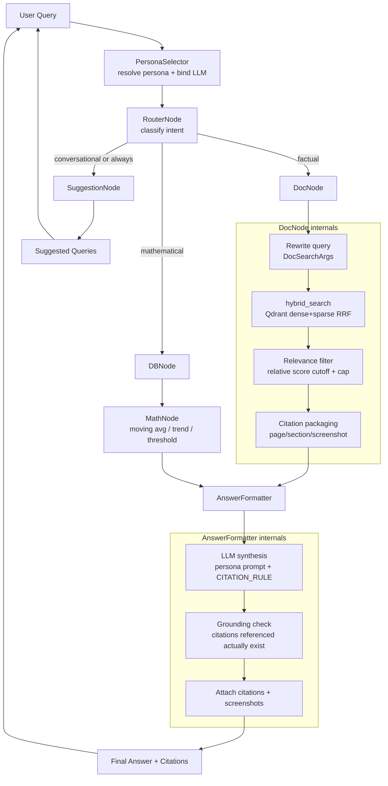

# Doc Node & Full Query-to-Answer Architecture

**Document type:** Component design / implementation plan
**Scope:** The Doc Node and the full query-to-answer graph (PersonaSelector → Router → DocNode/DBNode/MathNode → AnswerFormatter → SuggestionNode) that surrounds it.
**Companion to:** `docs/architecture-plan.md` (the phased build plan this design implements against). This document is a snapshot of the codebase as of 2026-08-25 and should be re-validated against current file contents before acting on any specific claim below.

---

## 1. Current Status Summary

Read every file under `backend/app/{nodes,retrieval,ingestion,core,schemas,llm,helper,tracing}` and `backend/app/api`. Here's what's actually there vs. stubbed.

**Built and working:**

| File | State |
|---|---|
| `backend/app/nodes/db_node.py` | **Fully implemented.** This is the reference pattern for every other node: a plain function `node(state: dict) -> dict`, reads `state["llm"]`/`state["query"]`/`state["adapter"]` (bound upstream), runs a generate→execute→retry-on-error loop, writes `db_result` + `db_attempts` back. |
| `backend/app/retrieval/base_store.py`, `sql_store.py`, `file_store.py` | Full `DataAdapter` family (SQLAlchemy + DuckDB), used by DBNode. |
| `backend/app/helper/sql_guard.py` | Read-only SQL validation boundary — solid. |
| `backend/app/llm/personas.py`, `provider_registry.py` | Persona = data (system prompt) + LLM binding via `get_model_for_persona()`. |
| `backend/app/core/intent_registry.py` | Intent vocabulary (`mathematical`/`factual`/`conversational`), classifier guidance text, and `INTENT_ROUTES` — the extensibility hook the plan calls for. |
| `backend/app/ingestion/pdf_processor.py`, `chunk_metadata.py`, `embedder.py`, `vector_indexer.py` | Solid PDF → markdown → header-based chunking → hybrid (dense+sparse) Qdrant indexing pipeline. Each chunk's payload carries `content`, `token_count`, `page_start`, `page_end`, `content_type` (text/table/mixed), `sections` (breadcrumb), and header levels. |
| `backend/app/retrieval/vector_store.py` | `hybrid_search(query, top_k, content_type=None)` — dense+sparse RRF fusion against Qdrant. **This is the retrieval primitive DocNode should call.** |
| `backend/app/schemas/query_schemas.py` | Already defines `DocSearchArgs` (a query-rewrite structured-output shape, mirroring `SQLQueryArgs`) even though nothing consumes it yet — this tells us the intended DocNode shape. |

**Empty (0 bytes) — the entire orchestration layer:**
`nodes/doc_node.py`, `nodes/router_node.py`, `nodes/math_node.py`, `nodes/persona_selector.py`, `nodes/suggestion_node.py`, `core/graph_state.py`, `core/graph_builder.py`, `schemas/citation_schemas.py`, `schemas/persona_schemas.py`, `schemas/trace_schemas.py`, `tracing/*.py`, `main.py`, all of `api/routes_*.py`, `compute/*.py`.

**Partially started:** `nodes/answer_formatter.py` has a docstring + a `CITATION_RULE` prompt constant already written, then `raise NotImplementedError`. That constant is a strong signal of intent: AnswerFormatter is meant to be the place where the LLM actually synthesizes prose with citations — not DocNode.

**Two real gaps worth flagging, not just stubs:**
1. **No screenshot/OCR rendering exists.** `config.py` defines `PAGE_IMAGES_DIR`, but nothing writes into it. The spec's "screenshot (from PDF render)" citation requirement has no producer yet.
2. **Import inconsistency bug:** `vector_store.py` imports via `from backend.app.ingestion.embedder import ...` (repo-root-relative), while every other module (`db_node.py`, `sql_store.py`, etc.) imports via `from app...` (backend-dir-relative, matching `conftest.py`'s `sys.path` setup). As written, `hybrid_search` will `ModuleNotFoundError` when imported the way the rest of the app runs. This needs a one-line fix before DocNode can call it.

---

## 2. Recommended Full Query-to-Answer Architecture

Keep the topology exactly as specified in `docs/architecture-plan.md` §5, and deliberately **do not** add new graph nodes for "critique" or "relevance" — those become internal steps inside existing nodes, per the "keep it lightweight" instruction. Adding them as separate LangGraph nodes would double the state-passing surface for no behavioral gain.

| Node | Responsibility | Reads from state | Writes to state |
|---|---|---|---|
| **PersonaSelector** | Resolve persona key → `Persona` + bind LLM via `provider_registry.get_model_for_persona`. Runs first so every downstream node has `state["llm"]`. | `persona_key` | `persona`, `llm` |
| **RouterNode** | Classify intent (`mathematical`/`factual`/`conversational`) via structured output using `intent_registry.CLASSIFIER_GUIDANCE`; look up `INTENT_ROUTES` to decide which node(s) fire. | `query`, `llm` | `intent`, `route` |
| **DocNode** | Rewrite query (optional) → hybrid search → relevance filter → citation packaging. *No prose synthesis here.* | `query`, `llm` | `doc_chunks`, `citations` |
| **DBNode** *(built)* | Draft SQL against the bound adapter, retry on error. | `query`, `llm`, `adapter` | `db_result`, `db_attempts` |
| **MathNode** | Pure-Python computation (moving average / trend / threshold) over `db_result` rows — no LLM. | `db_result`, `query` | `math_result` |
| **AnswerFormatter** | The single synthesis point. Calls the persona LLM once with `CITATION_RULE` + whatever of `doc_chunks`/`db_result`/`math_result` is populated, produces grounded prose, then runs the **lightweight grounding check** (see §3.5) and attaches `citations`/screenshot refs. | `persona`, `llm`, `doc_chunks`, `citations`, `db_result`, `math_result` | `answer`, `citations` (finalized) |
| **SuggestionNode** | Generate 1–2 follow-up queries. Returns straight to the UI in parallel with the main answer path — never blocks on AnswerFormatter. | `query`, `persona`, `llm` | `suggestions` |

This keeps every node's job single-purpose and matches the plan's edges: `PersonaSelector → Router`, `Router → {DocNode, DBNode, MathNode, SuggestionNode}`, `DBNode → MathNode`, `{DocNode, MathNode} → AnswerFormatter`, `SuggestionNode → UI` directly.

---

## 3. Detailed Design for Doc Node

Modeled directly on `db_node.py`'s shape (module-level helper + thin graph entrypoint), so the two nodes read as siblings.

### 3.1 Stage A — Query drafting (optional, cheap)
Use the LLM with structured output on the already-defined `DocSearchArgs` to turn a conversational question into a clean search string — exactly how `db_node.generate_sql` uses `SQLQueryArgs`. This is a single extra LLM call; skip it (fall back to `state["query"]` verbatim) if you want to cut latency early on — the schema being pre-defined suggests it's the intended v1 shape, so keep it, but it's the first thing to cut if it's not earning its cost.

### 3.2 Stage B — Retrieval
Call `hybrid_search(query, top_k=settings.DOC_TOP_K)` from `vector_store.py` (after fixing its import). Returns Qdrant `ScoredPoint`s already RRF-fused across dense+sparse — no reranking model needed at this stage.

### 3.3 Stage C — Relevance filtering (the "enhancement")
RRF scores aren't calibrated probabilities, so don't threshold on an absolute value. Keep it simple and relative:
- Keep points whose score is within some fraction (e.g. `>= 0.5 * top_score`) of the best match.
- Hard-cap at `MAX_CONTEXT_CHUNKS` (e.g. 5) regardless, to bound what goes into the AnswerFormatter prompt.
- If nothing survives the cutoff, return the raw top-1 anyway — an empty result set is worse than a possibly-weak citation, and AnswerFormatter's grounding check catches genuinely bad ones downstream.

This is ~10 lines of Python, no extra model call — matches "generic and lightweight."

### 3.4 Stage D — Citation packaging
For each surviving chunk, build a `Citation` (new `schemas/citation_schemas.py`) from the Qdrant payload fields that `vector_indexer.py` already writes: `document title`, `page_start`/`page_end`, `sections` (breadcrumb), `content_type`, and a `screenshot_path` field left `Optional[str] = None` until the OCR/page-render pipeline exists (§6, gap #1). Don't block DocNode on that gap — ship citations without images now, backfill the field later without touching this node.

DocNode's return shape is deliberately *not* an answer — it hands `doc_chunks` (raw content, for the formatter's prompt) and `citations` (structured, for the UI) to AnswerFormatter, which is the only node that talks to an LLM to produce prose. This mirrors how DBNode hands over `db_result` rather than narrating it.

### 3.5 Grounding check (lives in AnswerFormatter, not DocNode)
Keep it rule-based, not another LLM call: after AnswerFormatter drafts the answer, verify that any page/section reference it mentions actually appears in `state["citations"]`. If the answer cites something not in the retrieved set, either strip that claim or flag `state["grounded"] = False` for the trace view. This satisfies "basic critique/grounding check" without a second model round-trip.

---

## 4. Suggested State Schema

A `TypedDict` in `core/graph_state.py` (not a pydantic model — `db_node.py` treats state as a plain dict, so match that convention rather than introducing validation overhead LangGraph doesn't need):

```python
class GraphState(TypedDict, total=False):
    # input
    query: str
    persona_key: str
    thread_id: str

    # persona_selector
    persona: Persona
    llm: Any

    # router_node
    intent: Literal["mathematical", "factual", "conversational"]
    route: list[str]

    # doc_node
    doc_search_query: str
    doc_chunks: list[dict]
    citations: list[Citation]

    # db_node (existing)
    adapter: DataAdapter
    db_result: dict
    db_attempts: list[dict]

    # math_node
    math_result: dict

    # answer_formatter
    answer: str
    grounded: bool

    # suggestion_node
    suggestions: list[str]

    # tracing
    trace: list[dict]
```

`citations` is written by DocNode and re-attached (possibly filtered) by AnswerFormatter — both operate on the same `Citation` list rather than parallel structures.

---

## 5. Mermaid Diagram — Full Flow



---

## 6. Implementation Priority / Next Steps

Ordered so each step is independently testable, same philosophy as the phased plan in `docs/architecture-plan.md`:

1. **Fix the `vector_store.py` import** (`backend.app.*` → `app.*`) — one-line, unblocks everything else touching retrieval.
2. **`core/graph_state.py`** — the `TypedDict` above; every node's signature depends on this existing first.
3. **`schemas/citation_schemas.py`** — the `Citation` model, since DocNode and AnswerFormatter both need it.
4. **`nodes/doc_node.py`** — retrieval → relevance filter → citation packaging, per §3. Write a `doc_node_demo.py` script mirroring `db_agent_demo.py`'s stages, so retrieval correctness is provable outside the graph (matches the plan's Phase 2 exit criterion).
5. **`nodes/persona_selector.py`** — thin wrapper over `provider_registry.get_model_for_persona`, ~10 lines.
6. **`nodes/router_node.py`** — structured-output classifier using `intent_registry.CLASSIFIER_GUIDANCE`, dispatch via `INTENT_ROUTES`.
7. **`core/graph_builder.py`** — wire the `StateGraph` with the edges from §2.
8. **`nodes/answer_formatter.py`** — implement synthesis + grounding check; the `CITATION_RULE` constant is already there to build on.
9. **`nodes/suggestion_node.py`** — trivial follow-up generation call.
10. **`nodes/math_node.py` + `compute/*.py`** — currently all empty; implement moving average/trend/threshold and wire the `DBNode → MathNode` edge.
11. **Page-screenshot pipeline** (real gap) — extend `pdf_processor.py` to render each page to PNG under `PAGE_IMAGES_DIR`, keyed by document+page, and populate `Citation.screenshot_path`. Not blocking for 1–9.
12. **Tracing + API surface** — `tracing/trace_emitter.py`, `connection_manager.py`, `api/routes_query.py`, `main.py`. This is Phase 5 territory and should come after the graph itself works end-to-end via a script, same as DBNode was proven via `db_agent_demo.py` before any API route existed.

Steps 1–9 get you both sample query flows from the spec working end-to-end without touching computation or the frontend — that's the fastest path to a demonstrable slice.
