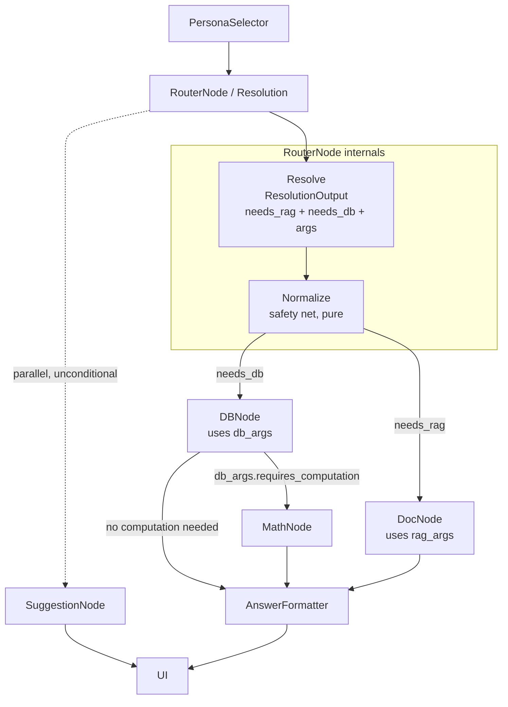

# Router Node Architecture (Resolution Node)

**Document type:** Component design
**Companion to:** `docs/architecture-plan.md`, `docs/doc-node-query-pipeline-design.md`
**Scope:** The node positioned right after PersonaSelector. Its job has changed from the previous revision of this document (domain + complexity classification) to a **resolution** job: decide whether the query needs RAG (DocNode), DB (DBNode), or both — and produce the structured arguments each of those nodes needs to run.

> **Supersedes:** the complexity/domain classification scheme in the prior version of this document, and `core/intent_registry.py`'s `mathematical`/`factual`/`conversational` vocabulary. Neither is used by this design. See §10 for what to do with the old file.

---

## 1. Purpose

The Router (Resolution Node) answers one question in one LLM call: **which retrieval path(s) does this query actually need — RAG, DB, or both?** Where the earlier design tried to infer this indirectly (domain classification, with a runtime fallback when domain guessed wrong), this design commits to the decision directly and, when genuinely uncertain, resolves to **both** rather than guessing one and falling back after failure.

It also produces the structured arguments each downstream node needs, scoped separately per path:
- **RAG args** — whatever DocNode needs to run its retrieval (at minimum, the query text; the rest of the fields are yours to define, see §7).
- **DB args** — whatever DBNode needs to generate SQL (at minimum, the question text; likewise open for your fields).

This keeps the same "one classifier, one LLM call, plan the rest in pure Python" shape the earlier design used and that `db_node.py` uses for SQL drafting — the change is in *what* gets decided and *how much* is committed to structured sub-objects instead of flat top-level fields.

---

## 2. Position in the Pipeline

```
PersonaSelector → ResolutionNode ─┬─→ DocNode ──────────────┐
                                   └─→ DBNode → [MathNode?]  ├─→ AnswerFormatter → SuggestionNode
                                                              ┘
```

Both branches can fire in the same graph step when `needs_rag` and `needs_db` are both true — this is a **fan-out**, not a single chosen path with a fallback. AnswerFormatter is the **fan-in**: it doesn't run until every node that was dispatched has returned, and it reads whichever of `doc_chunks`/`db_result`/`math_result` got populated. SuggestionNode still fires unconditionally in parallel, same as before — it never depends on the resolution.

---

## 3. Inputs & Outputs

| | Keys |
|---|---|
| **Reads from state** | `query` (str), `llm` (bound chat model, from PersonaSelector) |
| **Writes to state** | `needs_rag` (bool), `needs_db` (bool), `rag_args` (`RAGArgs \| None`), `db_args` (`DBArgs \| None`), `resolution_reason` (str — feeds the trace view, same role `SQLAttempt.reason` plays in `db_node.py`) |

`rag_args`/`db_args` are `None` exactly when the corresponding `needs_*` flag is `False` — DocNode and DBNode should each start by checking their own args object is present, not the boolean (the boolean is really just there for the trace view and for `graph_builder.py`'s dispatch logic; the args object is the source of truth for whether a node has what it needs to run).

---

## 4. Classification Design

One boolean pair, not a domain/complexity matrix:

| `needs_rag` | `needs_db` | Meaning |
|---|---|---|
| `True` | `False` | Pure document question — legal or financial wording, clauses, narrative. |
| `False` | `True` | Pure structured-data question — a number, trend, or comparison over the DB. |
| `True` | `True` | Genuinely needs both, **or** the model isn't confident enough to rule one out. Both nodes run; AnswerFormatter combines whatever both return. |
| `False` | `False` | Should not normally happen — treat as a classifier miss, not a valid state. See §10 for the safety net. |

This directly replaces the old domain axis (legal/finance/general) — domain was always a proxy for "which corpus," and `needs_rag`/`needs_db` says that outright instead of requiring a second inference step. It also replaces the old complexity axis's main job (deciding whether to add a fallback/chain step): whether `math_node` chains after `db_node` is now a property of the DB path itself, not a separate top-level classification — see §7's note on where that flag likely belongs in `DBArgs`.

**On the "both" case:** this is the design's answer to the Finance ambiguity from the previous version (a query that could be a numeric lookup or a narrative question, e.g. anything about a financial document). Rather than betting on one path and detecting failure afterward (the old `db_result.ok is False` fallback), the resolver is allowed to just say "both" up front when it isn't sure. This costs one extra retrieval call in the uncertain case, in exchange for not needing the conditional fallback edge at all. It's a straightforward trade — simpler graph wiring, slightly more retrieval traffic on ambiguous queries only.

---

## 5. Routing Logic

`graph_builder.py` dispatches based on the two booleans — no separate "plan" table is needed the way the old domain×complexity matrix needed one, since the booleans map directly onto which edges fire:

```python
def dispatch_after_resolution(state: dict) -> list[str]:
    targets = []
    if state["needs_rag"]:
        targets.append("doc_node")
    if state["needs_db"]:
        targets.append("db_node")
    return targets or ["doc_node"]     # neither flag set -> safety net, see §10
```

`db_node`'s own conditional edge (whether it chains into `math_node`) stays a separate, local decision made from `db_args` (or from `db_result` once DBNode has actually run) — it isn't something ResolutionNode needs to know about upfront, since it only affects the DB branch internally:

```python
def after_db_node(state: dict) -> str:
    if state["db_result"]["ok"] and state["db_args"].requires_computation:
        return "math_node"
    return "answer_formatter"
```

Both `doc_node` and (`db_node` → optionally `math_node`) converge on `answer_formatter` as their next edge — LangGraph runs `answer_formatter` once, after all of that step's dispatched branches complete, not once per branch.

---

## 6. Internal Stages / Design

Same two-stage shape as before, just resolving a different question:

1. **Resolve** — one `llm.with_structured_output(ResolutionOutput)` call against the raw query, asking for `needs_rag`, `needs_db`, and the two args sub-objects in a single response.
2. **Normalize** — a pure function `normalize(resolution) -> dict` that applies the §10 safety net (both flags false → default to RAG) and null-checks that an args object exists wherever its flag is true (if the model sets `needs_db=True` but leaves `db_args` empty, fill in a minimal `DBArgs(query=state["query"])` rather than letting a downstream node crash on `None`). This keeps DocNode/DBNode from ever having to defend against a malformed resolution — `router_node.py` owns that guarantee, the same way `plan_route` did in the previous design.

No retry loop, same reasoning as before: a structured-output call either parses or raises, there's no error message to feed back into a second attempt the way DBNode's SQL loop has.

---

## 7. Recommended Structured Output Schema

Add to `schemas/query_schemas.py`. `RAGArgs` and `DBArgs` are intentionally minimal below — **you'll define their real fields**; what's here is the smallest version that keeps the design usable today, plus comments marking the obvious extension points from the earlier domain/complexity design in case they're useful starting points.

```python
class RAGArgs(BaseModel):
    """What DocNode needs to run. Extend with your own fields."""

    query: str = Field(description="Search query for the document corpus.")
    # Candidates carried over from the domain/complexity design, if wanted:
    # domain_filter: Literal["legal", "finance"] | None = None
    # top_k: int | None = None


class DBArgs(BaseModel):
    """What DBNode needs to run. Extend with your own fields."""

    query: str = Field(description="Question phrased for SQL generation.")
    # Candidate carried over from the complexity axis, if wanted — this is
    # what decides the math_node chain in graph_builder's after_db_node:
    # requires_computation: bool = False


class ResolutionOutput(BaseModel):
    """What the ResolutionNode asks the persona LLM to produce."""

    needs_rag: bool = Field(description="True if the document corpus is relevant.")
    needs_db: bool = Field(description="True if the structured data source is relevant.")
    rag_args: RAGArgs | None = Field(
        default=None, description="Present iff needs_rag is True.")
    db_args: DBArgs | None = Field(
        default=None, description="Present iff needs_db is True.")
    reason: str = Field(
        default="", description="One line on why this resolution was chosen.")
```

Once you've settled on the real field lists for `RAGArgs`/`DBArgs`, the rest of this document (routing logic, code structure, diagram) doesn't need to change — they only depend on the `needs_rag`/`needs_db`/args-presence contract, not on what's inside the args objects.

---

## 8. Suggested Code Structure

`backend/app/nodes/router_node.py` — the file/function name (`router_node`) is unchanged from the earlier design even though the concept is now "resolution"; renaming isn't necessary since nothing else in the scaffold (`graph_builder.py`, `architecture-plan.md`'s file tree) needs to change to match, but rename freely if you'd rather it read as `resolution_node.py`.

```python
"""Router (Resolution) Node — decides whether the query needs RAG, DB, or both.

Phase 4. Supersedes core/intent_registry.py and the domain/complexity
classification from the previous revision of this design. See
docs/router-node-design.md for the full rationale.
"""

from __future__ import annotations

from typing import Any

from app.schemas.query_schemas import DBArgs, RAGArgs, ResolutionOutput

RESOLUTION_PROMPT = """Decide whether this query needs the document corpus \
(RAG), the structured data source (DB), or both.

- needs_rag: true if answering requires document wording, clauses, or \
narrative content.
- needs_db: true if answering requires numbers, trends, or comparisons from \
structured data.
- If you're not confident which one applies, set both to true rather than \
guessing.

Query: {question}"""


def resolve_query(llm: Any, question: str) -> ResolutionOutput:
    """Single structured-output call — mirrors db_node.generate_sql's shape."""
    resolver = llm.with_structured_output(ResolutionOutput)
    return resolver.invoke(RESOLUTION_PROMPT.format(question=question))


def normalize(resolution: ResolutionOutput, question: str) -> ResolutionOutput:
    """Apply the safety net and back-fill missing args. Pure — unit-testable
    directly against a ResolutionOutput, no LLM or graph needed."""
    needs_rag, needs_db = resolution.needs_rag, resolution.needs_db

    if not needs_rag and not needs_db:
        needs_rag = True    # neither flag set -> default to RAG, see §10

    rag_args = resolution.rag_args if needs_rag else None
    if needs_rag and rag_args is None:
        rag_args = RAGArgs(query=question)

    db_args = resolution.db_args if needs_db else None
    if needs_db and db_args is None:
        db_args = DBArgs(query=question)

    return resolution.model_copy(update={
        "needs_rag": needs_rag, "needs_db": needs_db,
        "rag_args": rag_args, "db_args": db_args,
    })


def router_node(state: dict) -> dict:
    """Graph entrypoint: state -> state."""
    resolution = normalize(resolve_query(state["llm"], state["query"]), state["query"])

    state["needs_rag"] = resolution.needs_rag
    state["needs_db"] = resolution.needs_db
    state["rag_args"] = resolution.rag_args
    state["db_args"] = resolution.db_args
    state["resolution_reason"] = resolution.reason   # feeds the trace view
    return state
```

`graph_builder.py` owns the fan-out/fan-in wiring shown in §5 — `router_node` itself never branches, it only writes the decision to state.

---

## 9. Mermaid Diagram



---

## 10. Implementation Notes

- **The "neither" safety net.** `needs_rag=False, needs_db=False` shouldn't happen if the prompt is followed, but a classifier miss is cheaper to guard against than to debug later — `normalize()` defaults to RAG in that case (matching the earlier design's General/GA default) rather than letting the graph have no dispatch target at all.
- **What replaced the runtime fallback.** The previous design's conditional edge on `db_result.ok is False` (fall through to `doc_node` when DBNode fails) is no longer the primary mechanism — the "both" resolution now covers genuine ambiguity upfront. It's still cheap to keep as an extra safety net (if `needs_db` alone was set and `db_node` comes back `ok=False`, route to `doc_node` as a last resort before `answer_formatter`) — worth adding once you see how often DBNode actually fails on queries that were resolved as DB-only.
- **`core/intent_registry.py`** is now unused by both this design and the previous one — delete it once `router_node.py` is implemented, unless something outside this pipeline still imports from it.
- **Where the math-chaining flag lives.** The earlier "complexity" axis's one concrete job — deciding if `math_node` chains after `db_node` — is now a `DBArgs` field (`requires_computation` in the placeholder above), not a ResolutionNode-level concern. This keeps ResolutionNode's output strictly about *which nodes run*, and pushes *how a node runs* into that node's own args, which is the right owner for it.
- **Testing.** `normalize()` is pure and should get direct unit tests over the four `(needs_rag, needs_db)` combinations, same spirit as the earlier `plan_route` tests. `resolve_query` only needs one or two live-LLM smoke tests — a clear RAG-only and a clear DB-only query — since the args-presence contract (not classifier accuracy) is what the rest of the graph depends on.
